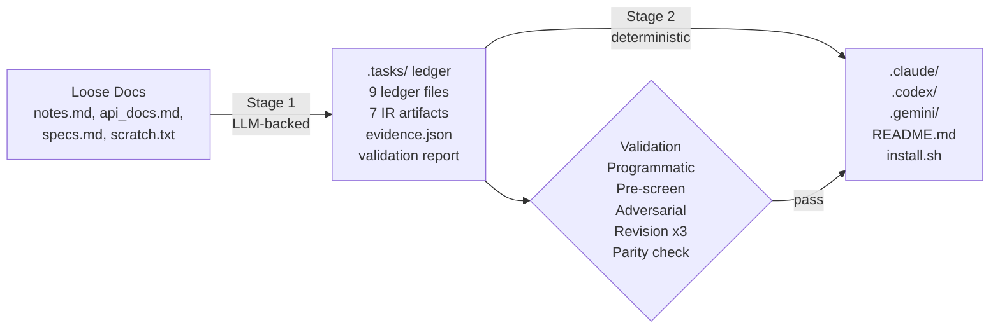
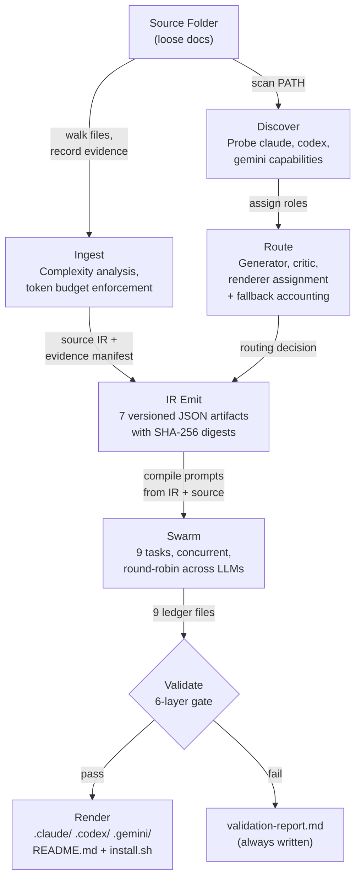
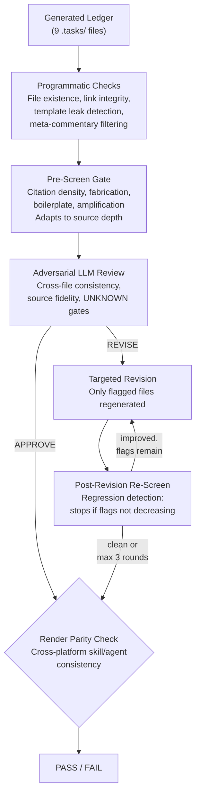

# SwarmMaker

Compile unstructured knowledge into validated, installable AI agent swarms.

## Problem Statement

Translating loose human knowledge (notes, API docs, specs, scratch files) into structured AI agent configurations is manual, error-prone, and non-reproducible. The resulting agent scaffolds drift from source material, contain unstated assumptions, break when switching model providers, and have no evidence trail proving correctness.

SwarmMaker automates this as a **two-stage compiler**:



**Stage 1** uses LLM calls to decompose source material into a shared `.tasks/` ledger with per-claim citations. **Stage 2** is a deterministic, LLM-free render from that ledger into platform-specific output trees. The expensive work happens once; rendering to N targets is a transform.

## Architecture

### Pipeline Phases

| Phase | LLM Calls | Input | Output | Failure Mode |
|-------|-----------|-------|--------|--------------|
| 1. Ingest | 0 | Source folder | Evidence manifest, complexity analysis | Missing/unreadable files recorded, not hidden |
| 2. IR Emit | 0 | Ingestion output + routing | 7 JSON artifacts under `.tasks/ir/` | Contract validation rejects malformed schemas |
| 3. Generate | 9 (parallelizable) | Compiled prompts + source | 9 `.tasks/` ledger files | Per-task retry with backoff; min-length enforcement |
| 4. Validate | 1-10 | Generated ledger | Validation report | Multi-round: programmatic → pre-screen → adversarial review → revision (up to 3 rounds) → post-screen |
| 5. Render | 0 | Validated ledger | Platform trees + README + installer | Atomic staged write; parity check across targets |

### Data Flow

The pipeline starts by walking the input folder and recording evidence for every file decision (read, skipped as binary, hidden, oversized, noise directory, symlink, or unreadable). It then scans PATH for installed LLM CLIs and probes their capabilities and versions. The routing module assigns generator, critic, and renderer roles based on user flags and available providers, logging any fallback (e.g., same-model critique when only one provider is installed).

Seven versioned JSON artifacts are emitted to `.tasks/ir/` -- product definition, source IR, provider capabilities, routing decision, output tree spec, tool synthesis request, and prompt IR with redacted source material. These form the auditable intermediate representation.

The swarm engine then compiles 9 prompts from the IR and source material and executes them concurrently (or serially for same-provider) with round-robin assignment across available LLMs. Each task produces one `.tasks/` ledger file. After generation, the validation pipeline runs (see below), and on success the renderer compiles the validated ledger into platform-specific output trees.



### Agent Decomposition Model

Generated agents follow the **OODA loop** (Observe-Orient-Decide-Act):

| Role | Responsibility | Example |
|------|---------------|---------|
| **Observe** | Gather and normalize input, preserve evidence | Alert ingestion, file inventory |
| **Orient** | Analyze, correlate, decompose into structure | Alert correlation, dependency mapping |
| **Decide** | Apply rules, validate constraints, choose paths | Priority classification, routing decisions |
| **Act** | Execute workflows, produce outputs | Runbook generation, notification delivery |

Multiple agents may share an OODA role when the domain requires distinct execution concerns within a phase. The agent count is the minimum required to cover all source-backed responsibilities.

## Design Invariants

These are not guidelines. They are enforced by the pipeline and tested:

| Invariant | Enforcement |
|-----------|-------------|
| No silent defaults | Missing required facts become `UNKNOWN`; dependent decisions are blocked |
| No hidden fallbacks | Every fallback is counted, recorded in evidence, and visible in the validation report |
| No fabrication | Pre-screen detects fabrication patterns; adversarial review checks source fidelity |
| No partial output | Atomic staged writes; incomplete runs leave no artifacts in the output directory |
| No untracked provider routing | Routing decisions are persisted as machine-readable JSON with fallback accounting |
| No success without evidence | Validation report is mandatory on both success and failure paths |
| No cross-target drift | Parity validation checks skill/agent/metadata consistency across all selected platforms |
| No stale citations | Programmatic link checker + template leak detector run before and after revision |

## Performance Characteristics

Measured on a real 4-file input (10KB source material) producing a codex skill bundle:

| Metric | Claude CLI | Codex CLI | Mixed (Claude gen + Codex critic) |
|--------|-----------|-----------|-----------------------------------|
| Generation (9 tasks) | ~18 min (serial) | ~18 min (serial) | ~7 min (concurrent) |
| Adversarial review | ~2 min | ~2 min | N/A (uses critic) |
| Revision (per file) | ~2 min | ~2 min | N/A (uses generator) |
| Total (with revision) | ~35 min | ~35 min | ~25 min |
| Output size (skills.md) | ~62 KB | ~88 KB | Varies by generator |
| Skill count | ~11 | ~10 | Varies by generator |

Codex uses `model_reasoning_effort=medium` to avoid multi-minute agentic loops. Claude uses `-p` for direct prompt-to-response. Both produce operational-depth skills with numbered process steps, inline schemas, and MUST/MUST NOT constraints.

Scaling: generation time is O(N) in task count (currently fixed at 9). Prompt size is O(S) in source material size. Revision rounds are bounded at 3 with regression detection.

## Comparison With Alternatives

| Approach | SwarmMaker | LangChain/CrewAI/AutoGen | Manual prompt engineering |
|----------|-----------|--------------------------|--------------------------|
| When it runs | Build time (offline) | Runtime (online) | Human time |
| Output | Static reviewable files | Running processes | Prompts in code |
| Provider lock-in | None (renders to any target) | Framework-specific | Provider-specific |
| Validation | Adversarial + programmatic | Unit tests on chains | Manual review |
| Evidence trail | Full (evidence.json, IR, report) | Logs | None |
| Reproducibility | Same input → same structure | Non-deterministic | Depends on author |
| Source fidelity | Per-claim citations required | No citation contract | No citation contract |

SwarmMaker does not replace runtime agent frameworks. It produces the **knowledge artifacts** those frameworks consume.

## Installation

### From source

```bash
make build
# Binary at ./build/swarm-me
```

Install to `~/.local/bin`:

```bash
make install
```

### Prerequisites

At least one LLM CLI:

- [claude](https://docs.anthropic.com/en/docs/claude-cli) (Anthropic)
- [codex](https://github.com/openai/codex) (OpenAI)
- [gemini](https://ai.google.dev/gemini-api/docs/cli) (Google)

Check availability: `swarm-me discover`

## Usage

```
swarm-me --input <dir> --model <provider> --output-swarm <format> [flags]
```

### Flags

| Flag | Required | Description |
|------|----------|-------------|
| `--input <dir>` | Yes | Source documentation folder |
| `--model <provider>` | Yes | Generator LLM: `codex`, `claude`, or `gemini` |
| `--output-swarm <format>` | Yes | Target(s): `claude`, `codex`, `gemini`, `all`, or comma-separated |
| `-o, --output-folder <dir>` | No | Output folder (default: `.`) |
| `--critique <provider>` | No | Critic LLM (auto-detected if omitted) |
| `-n, --name <name>` | No | Project name (derived from folder if omitted) |
| `--model-primary <model>` | No | Specific model override for generator |
| `--model-critic <model>` | No | Specific model override for critic |
| `--prompt-pack <path>` | No | Custom prompt pack JSON |
| `--dry-run` | No | Preview without LLM calls |
| `--force` | No | Overwrite existing output |
| `-v, --verbose` | No | Show full LLM interactions |

### Examples

```bash
# Claude generates, codex reviews, output as codex skill bundle
swarm-me --input ./notes --model claude --critique codex --output-swarm codex -o ./SKILL

# All platforms from one run
swarm-me --input ./notes --model claude --output-swarm all -o ./SKILL

# Custom prompt pack
swarm-me prompt-pack export -o ./pack.json   # export, edit, then:
swarm-me --input ./notes --model claude --output-swarm codex --prompt-pack ./pack.json -o ./SKILL
```

## Output Structure

```
<output>/
  .tasks/                          # Stage 1: shared build ledger
    context.md                     # Source context with per-claim citations
    tasks.md                       # Task decomposition from source goals
    skills.md                      # Skill definitions (renderer input)
    agents.md                      # Agent definitions (renderer input)
    todo.md                        # Delivery queue with OODA phases
    prompts/{product,technical,    # Domain-specific compiled prompts
             tools,deployment}.md
    ir/                            # 7 versioned JSON artifacts
    evidence.json                  # Ingestion + generation evidence
    manifest.json                  # Build manifest with digests
    validation-report.md           # Full PASS/FAIL report
  .codex/                          # Stage 2: platform-specific tree
    AGENTS.md                      # Agent router with OODA roles
    README.md                      # Skill bundle readme
    instructions/                  # Per-skill instruction files
      index.md
      <skill-slug>.md ...
  README.md                        # Bundle readme
  install.sh                       # Installer (--target, --global)
```

## Validation Pipeline

Every generated ledger passes through six validation layers before output is written. No layer can be skipped.

The pipeline starts with zero-LLM-cost programmatic checks: file existence, minimum sizes, markdown link integrity, template leak detection (16 known patterns that LLMs might copy from prompt instructions), and meta-commentary filtering (rejecting outputs that describe what they did instead of producing the artifact).

Next, a pre-screen gate runs depth-adaptive heuristics. Shallow sources get lenient citation checks. Deep sources (like our alert triage example with 33 sections) require higher citation density using a sub-linear formula, dimension coverage verification, and amplification ratio checks. Fabrication patterns and boilerplate injection are checked regardless of depth. The pre-screen produces per-file flags: concrete flags (specific problems like "low citation density: 24 citations in 20K chars, expect 25") block the build, while advisory flags (like "missing Process section") inform the reviewer without blocking.

If concrete flags exist, they are forwarded to the adversarial LLM review -- a separate call to the critic provider that evaluates cross-file consistency, source fidelity, coverage gaps, and UNKNOWN gate enforcement. The reviewer returns APPROVE or REVISE with per-file findings. Critically, concrete pre-screen findings block approval even if the reviewer says APPROVE -- the programmatic layer has veto power over the LLM.

When the verdict is REVISE, only flagged files are regenerated in targeted revision rounds. After each round, a post-revision re-screen checks whether the revision improved things. If the flag count decreased, another round runs (up to 3 total). If the count didn't decrease (regression), the loop stops immediately to avoid wasting LLM calls on revisions that aren't helping.

Finally, when multiple output formats are selected, a render parity check verifies that all platform trees contain the same skills, agent roles, metadata, and source references. Drift between platforms is a hard failure.

The validation report at `.tasks/validation-report.md` is written on both success and failure paths. If the report file cannot be written, it is dumped to stderr as a last resort.



## Development

```bash
make build     # Compile to ./build/swarm-me
make test      # All tests with -race
make fmt       # gofmt
make lint      # golangci-lint
make all       # fmt + lint + test + build
make release   # Cross-compile (linux/darwin/windows, amd64/arm64)
```

Source code lives in `src/swarmmaker/`. The root Makefile delegates all Go commands there.

### Release

[GoReleaser](https://goreleaser.com/) builds for linux/darwin/windows on amd64/arm64. Version injected via `-X main.version={{.Version}}`.

## Known Limitations

1. **LLM output is non-deterministic.** Two runs with the same input produce structurally similar but textually different ledgers. The validation pipeline catches drift but cannot guarantee identical output.
2. **No incremental regeneration.** Changing one source file regenerates all 9 ledger files. Delta-based regeneration is not implemented.
3. **Single revision target per round.** The adversarial reviewer sees all files but revision is per-file, not holistic. Cross-file issues may require multiple rounds.
4. **No runtime validation.** SwarmMaker validates the generated artifacts, not whether the installed skill bundle actually works when invoked by an agent at runtime.
5. **Tool synthesis is planning-only.** The tool synthesis module decides whether tools are needed and what language they should use, but does not generate executable code.
6. **Citation density heuristic.** The pre-screen uses a sub-linear formula for expected citation count. Very long documents (>50K chars) may trigger false positives.

## License

See [LICENSE](LICENSE).
