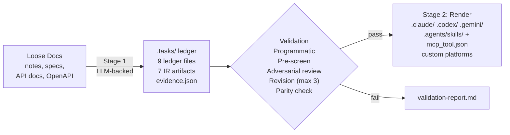
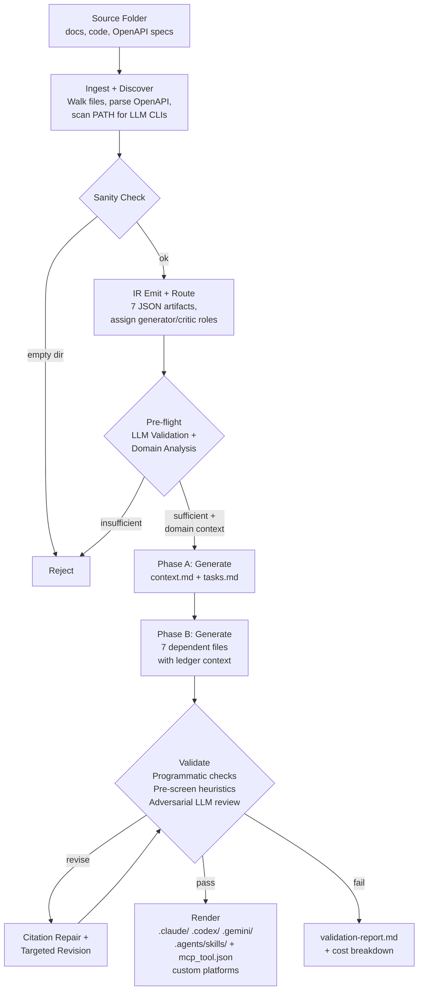
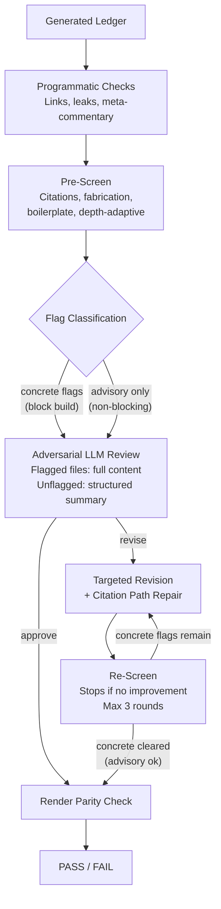

# SwarmMaker

Compile unstructured knowledge into validated, installable AI agent swarms.

## Problem Statement

Translating loose knowledge (notes, API docs, specs, scratch files) into structured AI agent configurations is manual, error-prone, and non-reproducible. The resulting agent scaffolds drift from source material, contain unstated assumptions, break when switching model providers, and have no evidence trail proving correctness. 

SwarmMaker automates this as a **two-stage compiler**:



**Stage 1** uses LLM calls to decompose source material into a shared `.tasks/` ledger with per-claim citations. **Stage 2** is a deterministic, LLM-free render from that ledger into platform-specific output trees. The expensive work happens once; rendering to N targets is a transform.

## Architecture

### Pipeline Phases

| Phase | LLM Calls | Input | Output | Failure Mode |
|-------|-----------|-------|--------|--------------|
| 1. Ingest | 0 | Source folder | Evidence manifest, complexity analysis, OpenAPI parsing | Missing/unreadable files recorded, not hidden; OpenAPI specs parsed into structured endpoints; basic sanity gate rejects empty dirs |
| 2. IR Emit | 0 | Ingestion output + routing | 7 JSON artifacts under `.tasks/ir/` | Contract validation rejects malformed schemas |
| 2.5 Pre-flight | 1 | Summary + complexity metrics | SUFFICIENT/INSUFFICIENT verdict + domain analysis (domain, key entities, tool/API detection) | Rejects material too thin for skill decomposition (~$0.01); on success, injects structured domain context into generation prompts |
| 3. Generate | 9 (two-phase) | Compiled prompts + source | 9 `.tasks/` ledger files | Phase A (context+tasks) then Phase B (7 dependent files with ledger context); per-task retry with backoff |
| 4. Validate | 1-10 | Generated ledger | Validation report | Multi-round: programmatic → pre-screen → adversarial review → revision (up to 3 rounds) → post-screen |
| 5. Render | 0 | Validated ledger | Platform trees + MCP tool defs + README + installer | Atomic staged write; MCP tool JSON per skill; parity check across targets; optional custom platform output |

### Data Flow

The pipeline starts by walking the input folder and recording evidence for every file decision (read, skipped as binary, hidden, oversized, noise directory, symlink, or unreadable). It detects source code files and infers their language and purpose for tool integration. OpenAPI and Swagger specs (`.yaml`, `.yml`, `.json`) are detected automatically and parsed into structured endpoint summaries with methods, parameters, and schemas — giving the LLM accurate API context instead of raw spec text. It then scans PATH for installed LLM CLIs (claude, codex, gemini, ollama) and probes their capabilities and versions. The routing module assigns generator, critic, and renderer roles based on user flags and available providers, logging any fallback (e.g., same-model critique when only one provider is installed).

The pipeline then emits an **Intermediate Representation (IR)**, a set of seven versioned JSON artifacts written to `.tasks/ir/`. The IR captures everything the pipeline knows before any LLM generation begins. It serves three purposes: it gives every downstream prompt a consistent, typed view of the project; it provides a complete audit trail of the decisions made during ingestion and routing; and it allows any step in the pipeline to be reproduced or debugged independently. The seven artifacts are:

| Artifact | What it captures |
|----------|-----------------|
| `product-definition.json` | Project name, target output formats, generator/critic/renderer providers |
| `source-ir.json` | Every ingested file with path, type, size, and content digest |
| `provider-capabilities.json` | Discovered LLM CLIs, their versions, and supported capabilities |
| `routing-decision.json` | Which provider was assigned to each role and any fallback events |
| `output-tree-spec.json` | The target platform tree structure (paths, required files, metadata) |
| `tool-synthesis-request.json` | Whether helper tools are needed, which languages were detected, and what evidence supports the decision |
| `prompt-ir.json` | The prompt metadata passed to every LLM call, with source material redacted for secrets |

Each artifact is validated against its schema contract before being written. A SHA-256 digest is computed per artifact and recorded in a manifest (`ir/manifest.json`) so downstream consumers can verify integrity.

Before generation, a pre-flight LLM call (~$0.01) evaluates whether the source material is rich enough to decompose into skills. If insufficient, the run exits with a specific explanation of what is missing, saving 9+ expensive generation calls. On success, the pre-flight returns structured domain analysis (domain description, key entities, procedure/API/tool detection) that is injected into the PromptIR context block for all downstream generation prompts.

Generation runs in two phases. Phase A produces the foundational files (context.md, tasks.md) first. Phase B then generates the remaining 7 files with a summary of Phase A output injected into their prompts, ensuring cross-file consistency from the start rather than catching contradictions only in review. Tasks within each phase run concurrently (or serially for same-provider) with round-robin assignment across available LLMs.

After generation, the validation pipeline runs (see below). After each revision round, a citation path repair step fixes near-miss path hallucinations where the LLM mangled a directory path but kept the filename correct. On success, the renderer compiles the validated ledger into platform-specific output trees plus the cross-platform `.agents/skills/` standard path.



### Agent Decomposition Model

Generated agents follow the **OODA loop** (Observe-Orient-Decide-Act):

| Role | Responsibility | Example |
|------|---------------|---------|
| **Observe** | Gather and normalize input, preserve evidence | Alert ingestion, file inventory |
| **Orient** | Analyze, correlate, decompose into structure | Alert correlation, dependency mapping |
| **Decide** | Apply rules, validate constraints, choose paths | Priority classification, routing decisions |
| **Act** | Execute workflows, produce outputs | Runbook generation, notification delivery |

Multiple agents may share an OODA role when the domain requires distinct execution concerns within a phase. The agent count is the minimum required to cover all source-backed responsibilities.

## Design Invariants

These are not guidelines. They are enforced by the pipeline and tested:

| Invariant | Enforcement |
|-----------|-------------|
| No silent defaults | Missing required facts become `UNKNOWN`; dependent decisions are blocked |
| No hidden fallbacks | Every fallback is counted, recorded in evidence, and visible in the validation report |
| No fabrication | Pre-screen detects fabrication patterns; adversarial review checks source fidelity |
| No partial output | Atomic staged writes; incomplete runs leave no artifacts in the output directory |
| No untracked provider routing | Routing decisions are persisted as machine-readable JSON with fallback accounting |
| No success without evidence | Validation report is mandatory on both success and failure paths |
| No cross-target drift | Parity validation checks skill/agent/metadata consistency across all selected platforms |
| No stale citations | Programmatic link checker + template leak detector run before and after revision |

## Performance Characteristics

Measured on a real 4-file input (10KB source material) producing a codex skill bundle:

| Metric | Claude CLI | Codex CLI | Mixed (Claude gen + Codex critic) |
|--------|-----------|-----------|-----------------------------------|
| Generation (9 tasks) | ~18 min (serial) | ~18 min (serial) | ~7 min (concurrent) |
| Adversarial review | ~2 min | ~2 min | N/A (uses critic) |
| Revision (per file) | ~2 min | ~2 min | N/A (uses generator) |
| Total (with revision) | ~35 min | ~35 min | ~25 min |
| Output size (skills.md) | ~62 KB | ~88 KB | Varies by generator |
| Skill count | ~11 | ~10 | Varies by generator |

Codex uses `model_reasoning_effort=medium` to avoid multi-minute agentic loops. Claude uses `-p` for direct prompt-to-response. Both produce operational-depth skills with numbered process steps, inline schemas, and Required/Prohibited constraints. The validation report includes a per-task cost breakdown table covering every LLM call in the pipeline.

Scaling: generation time is O(N) in task count (currently fixed at 9). Prompt size is O(S) in source material size. Revision rounds are bounded at 3 with regression detection.

### End-to-End Workflow

The full production workflow is: generate → validate → iterate.

```bash
# 1. Generate the skill bundle
swarm-maker --input ./notes --model codex --output-swarm claude -o ./SKILL

# 2. Validate skills are discoverable and triggerable
swarm-maker validate --bundle ./SKILL --target claude

# 3. Iterate on individual skills without re-running the full pipeline
swarm-maker regen --skill hash-hunt --input ./notes --model codex -o ./SKILL

# 4. Re-validate after changes
swarm-maker validate --bundle ./SKILL --target claude
```

## Comparison With Alternatives

| Approach | SwarmMaker | LangChain/CrewAI/AutoGen | Manual prompt engineering |
|----------|-----------|--------------------------|--------------------------|
| When it runs | Build time (offline) | Runtime (online) | Human time |
| Output | Static reviewable files | Running processes | Prompts in code |
| Provider lock-in | None (renders to any target) | Framework-specific | Provider-specific |
| Validation | Adversarial + programmatic | Unit tests on chains | Manual review |
| Evidence trail | Full (evidence.json, IR, report) | Logs | None |
| Reproducibility | Same input → same structure | Non-deterministic | Depends on author |
| Source fidelity | Per-claim citations required | No citation contract | No citation contract |

SwarmMaker does not replace runtime agent frameworks. It produces the **knowledge artifacts** those frameworks consume.

## Use Cases

### Turn a codebase into agent skills

Point SwarmMaker at a repository and it generates skills that know how to use the tools in that codebase. The pipeline detects source files, infers languages and entry points, and produces skills with exact invocation commands.

**Example:** A Python threat hunting toolkit with `hash2processarg.py`, `multikeyword_search.py`, and an AMP API client:

```bash
swarm-maker --input ./amp-toolkit --model codex --output-swarm claude -o ./SKILL
```

Generated skill `hash-ioc-process-arguments` includes:
```markdown
### Process
1. Validate every supplied line as SHA256 using the pattern ^[a-fA-F0-9]{64}$.
   Source: [amp_client/utils/validators.py](...)
2. Run `python3 hash2processarg.py -c config.txt hashset/windows-binaries/cmd.exe.txt`
   for single-source mode or `python3 hash2processarg.py -c config.txt hashes.txt --csv output.csv`
   for batch mode. Source: [readme.md](...)
3. CHECKPOINT: capture every returned execution record with both the process SHA256
   and child SHA256. If no child SHA256 is returned, store UNKNOWN explicitly.
```

The agent can now execute the actual tool with the actual flags from the actual source. No invented commands.

### Security operations and threat hunting

A security team has runbooks, hash databases, keyword files, API clients, and an OpenAPI spec for their endpoint protection platform. SwarmMaker compiles these into validated skills covering the full hunting workflow.

**Example:** From a folder containing AMP client code, SHA256 hash sets, IOC keyword files, and an API spec, SwarmMaker generated 10 skills:

| Skill | What the agent can do | MCP Params |
|-------|----------------------|------------|
| `credential-theft-hunt` | Combine tool hashes + LSASS keywords to detect credential dumping | 4 |
| `keyword-ioc-sweep` | Multi-type IOC search (hash, IP, string) with type classification | 6 |
| `lateral-movement-detection` | Detect lateral movement via network + process correlation | 6 |
| `network-connection-hunting` | Hunt malicious connections by hash or URL pattern | 6 |
| `persistence-mechanism-hunt` | Detect registry, service, and scheduled task persistence | 3 |
| `timeline-analysis` | Reconstruct per-endpoint event timelines | 5 |
| `hash-ioc-process-arguments` | Map SHA256 hashes to process execution records with CLI args | 3 |
| `event-extraction-by-type` | Extract specific AMP event types for analysis | 4 |
| `statistics-anomaly-reporting` | Statistical anomaly detection across endpoint fleet | 3 |
| `vulnerability-triage` | Triage CVE exposure across monitored endpoints | 3 |

Each skill includes exact CLI commands from the source (`python3 hash2processarg.py -c config.txt hashset/hacking-tools/mimikatz.txt --csv mimikatz_hits.csv`), MITRE ATT&CK technique mappings, and an MCP tool definition with typed input parameters.

### Compile API documentation into tool-using agents

Feed SwarmMaker your API documentation (REST endpoints, SDKs, OpenAPI specs) and it produces agents that know how to call your APIs with correct parameters, authentication, and error handling.

**Example:** An internal platform with a REST API, Python SDK, and Swagger spec:

```bash
# API docs + SDK source + OpenAPI spec in one folder
swarm-maker --input ./platform-docs --model claude --output-swarm codex -o ./SKILL
```

SwarmMaker auto-detects the OpenAPI spec and parses it into structured endpoints:
```markdown
### GET /v1/computers
List monitored endpoints
**Parameters**: `limit` (query) [integer], `hostname` (query) [string]

### GET /v1/events
Get security events
**Parameters**: `start_date` (query) [string] *required*, `event_type` (query) [integer]

### POST /v1/file_lists/application_blocking
Add SHA256 to blocking list
**Parameters**: `sha256` (query) [string] *required*
```

The generated skills reference these endpoints with correct parameter types instead of hallucinating API contracts. The MCP tool definition includes a JSON Schema matching the API parameters, so MCP-compatible tool servers can call the API directly.

### Onboarding domain knowledge

A team has accumulated institutional knowledge across dozens of documents. New team members take weeks to absorb it. SwarmMaker compiles the documentation into structured skill files that an AI assistant can load immediately.

**Example:** An SRE team with runbooks, architecture diagrams, incident response procedures, and monitoring tool configs:

```bash
swarm-maker --input ./sre-knowledge --model codex --output-swarm all -o ./SKILL
```

The output installs into Claude, Codex, and Gemini simultaneously. A new engineer asks Claude "how do I investigate a disk pressure alert on the payment cluster?" and the agent responds with the exact procedure from the team's runbook, citing the source document, not generating a generic answer.

### Multi-provider deployment

An organization uses Claude for engineering, Codex for data teams, and Gemini for operations. SwarmMaker compiles once and renders to all three from the same intermediate representation.

```bash
# One compilation, three platform outputs
swarm-maker --input ./docs --model codex --output-swarm all -o ./SKILL

# Output:
# ./SKILL/.claude/skills/alert-triage/SKILL.md
# ./SKILL/.codex/instructions/alert-triage.md
# ./SKILL/.gemini/playbooks/alert-triage.md
# ./SKILL/.agents/skills/alert-triage/SKILL.md      (cross-platform)
# ./SKILL/.agents/skills/alert-triage/mcp_tool.json  (MCP definition)
```

Render parity validation ensures all three platform trees contain identical skills and metadata. If a skill exists in `.claude/` but is missing from `.codex/`, the pipeline fails.

### Iterative skill refinement

After generating a full bundle (~25 min), a domain expert reviews the output and identifies one skill that needs work. Instead of re-running the full pipeline, they target that single skill:

```bash
# Regenerate one skill (2 min instead of 25 min)
swarm-maker regen --skill credential-theft-hunt --input ./docs --model codex -o ./SKILL

# Verify it triggers correctly
swarm-maker validate --bundle ./SKILL --target claude

# Result: 10/10 skills validated
```

The `regen` command atomically updates the SKILL.md, mcp_tool.json, all platform-specific trees, references, and the source ledger. Sibling skills are untouched.

### Compliance and audit trails

Regulated industries need provenance for automated decisions. SwarmMaker provides a complete evidence chain:

```
Evidence chain for any agent instruction:
  Skill process step → Source: citation → Original document
  │
  ├── .tasks/evidence.json       (every ingestion decision logged)
  ├── .tasks/ir/manifest.json    (SHA-256 digests for all IR artifacts)
  ├── .tasks/validation-report.md (what was checked, what passed/failed)
  └── Per-task cost breakdown     (every LLM call with tokens and USD)
```

When an auditor asks "why does this agent classify alerts using P0-P3 rules?", the answer traces through: skill process step 3 → `Source: [ops-runbook.md section 2.1]` → the actual text in the original document.

### Custom agent platforms

A team uses an internal framework with its own skill format. They define a YAML spec:

```yaml
platform: internal-orchestrator
skill_path: "workflows/{slug}/config.md"
frontmatter: true
frontmatter_fields: [name, description, version]
sections: [summary, process, constraints]
```

```bash
swarm-maker --input ./docs --model codex --output-swarm claude,custom:internal.yaml -o ./SKILL

# Output includes standard Claude tree AND custom platform:
# ./SKILL/workflows/alert-triage/config.md
# ./SKILL/workflows/hash-hunt/config.md
# ...
```

No code changes. No rebuild. The renderer reads the spec and produces the custom output tree alongside standard platforms.

## Installation

### From source

```bash
make build
# Binary at ./build/swarm-maker
```

Install to `~/.local/bin`:

```bash
make install
```

### Prerequisites

At least one LLM CLI:

- [claude](https://docs.anthropic.com/en/docs/claude-cli) (Anthropic)
- [codex](https://github.com/openai/codex) (OpenAI)
- [gemini](https://ai.google.dev/gemini-api/docs/cli) (Google)
- [ollama](https://ollama.com/) (Local LLMs — offline/free usage)

Check availability: `swarm-maker discover`

## Usage

```
swarm-maker --input <dir> --model <provider> --output-swarm <format> [flags]
```

### Flags

| Flag | Required | Description |
|------|----------|-------------|
| `--input <dir>` | Yes | Source documentation folder |
| `--model <provider>` | Yes | Generator LLM: `codex`, `claude`, `gemini`, or `ollama` |
| `--output-swarm <format>` | Yes | Target(s): `claude`, `codex`, `gemini`, `all`, comma-separated, or `custom:<spec.yaml>` |
| `-o, --output-folder <dir>` | No | Output folder (default: `.`) |
| `--critique <provider>` | No | Critic LLM (auto-detected if omitted) |
| `-n, --name <name>` | No | Project name (derived from folder if omitted) |
| `--model-primary <model>` | No | Specific model override for generator |
| `--model-critic <model>` | No | Specific model override for critic |
| `--prompt-pack <path>` | No | Custom prompt pack JSON |
| `--dry-run` | No | Preview without LLM calls |
| `--force` | No | Overwrite existing output |
| `-v, --verbose` | No | Show full LLM interactions |

### Examples

```bash
# Claude generates, codex reviews, output as codex skill bundle
swarm-maker --input ./notes --model claude --critique codex --output-swarm codex -o ./SKILL

# All platforms from one run
swarm-maker --input ./notes --model claude --output-swarm all -o ./SKILL

# Local LLM via Ollama (offline, free)
swarm-maker --input ./notes --model ollama --output-swarm claude -o ./SKILL

# Regenerate a single skill without re-running the full pipeline (~18 min saved)
swarm-maker regen --skill hunt-hashes --input ./notes --model codex -o ./SKILL

# Custom output platform via YAML spec
swarm-maker --input ./notes --model claude --output-swarm claude,custom:my-platform.yaml -o ./SKILL

# Validate generated skills against a live LLM
swarm-maker validate --bundle ./SKILL --target claude

# Custom prompt pack
swarm-maker prompt-pack export -o ./pack.json   # export, edit, then:
swarm-maker --input ./notes --model claude --output-swarm codex --prompt-pack ./pack.json -o ./SKILL
```

### Subcommands

| Command | Description |
|---------|-------------|
| `swarm-maker discover` | Discover available LLM CLI tools on your system |
| `swarm-maker regen --skill <slug> --input <dir> --model <provider>` | Regenerate a single skill without re-running the full pipeline |
| `swarm-maker validate --bundle <dir> --target <provider>` | Validate skill discoverability and triggerability against a live LLM CLI |
| `swarm-maker prompt-pack export -o <file>` | Export the default prompt pack for customization |
| `swarm-maker version` | Print swarm-maker version |

## Per-Skill Regeneration

The `regen` subcommand re-generates a single skill by slug without re-running the full pipeline. It reads the existing `.tasks/` ledger, compiles a focused prompt for the target skill (injecting sibling skill slugs as context), runs one LLM call, and atomically updates all artifacts for that skill:

- `.agents/skills/<slug>/SKILL.md` — cross-platform skill definition
- `.agents/skills/<slug>/mcp_tool.json` — MCP tool definition with updated input schema
- `.agents/skills/<slug>/references/` — progressive disclosure split (if applicable)
- `.claude/skills/<slug>/SKILL.md`, `.codex/instructions/<slug>.md`, `.gemini/playbooks/<slug>.md` — platform-specific trees
- `.tasks/skills.md` — ledger source of truth (skill block replaced in-place)

This saves ~18 minutes per iteration compared to a full pipeline run. Sibling skills are preserved unchanged.

```bash
swarm-maker regen --skill hunt-hashes --input ./notes --model codex -o ./SKILL
```

## Output Structure

```
<output>/
  .tasks/                          # Stage 1: shared build ledger
    context.md                     # Source context with per-claim citations
    tasks.md                       # Task decomposition from source goals
    skills.md                      # Skill definitions (renderer input)
    agents.md                      # Agent definitions (renderer input)
    todo.md                        # Delivery queue with OODA phases
    prompts/{product,technical,    # Domain-specific compiled prompts
             tools,deployment}.md
    ir/                            # 7 versioned JSON artifacts
    evidence.json                  # Ingestion + generation evidence
    manifest.json                  # Build manifest with digests
    validation-report.md           # Full PASS/FAIL report + cost breakdown
  .agents/                         # Cross-platform standard path
    skills/
      <skill-slug>/
        SKILL.md                   # Frontmatter + body (platform-agnostic)
        mcp_tool.json              # MCP-compatible tool definition (JSON Schema)
  .claude/                         # Platform-specific: Claude
    SKILL.md                       # Skill router
    README.md                      # Skill bundle readme
    skills/<skill-slug>/SKILL.md   # Per-skill instruction files
  .codex/                          # Platform-specific: Codex
    AGENTS.md                      # Agent router with OODA roles
    README.md                      # Skill bundle readme
    instructions/                  # Per-skill instruction files
      index.md
      <skill-slug>.md ...
  .gemini/                         # Platform-specific: Gemini
    GEMINI.md                      # Playbook router
    README.md                      # Skill bundle readme
    playbooks/                     # Per-skill playbook files
      index.md
      <skill-slug>.md ...
  plugins/{slug}/prompt.md ...     # Custom platform output (if --output-swarm custom:spec.yaml)
  README.md                        # Bundle readme
  REVIEW_CHECKLIST.md              # Human review checklist before deploying
  install.sh                       # Installer (--target, --global)
  .gitignore                       # Excludes debug artifacts from git
```

`.agents/skills/` is the cross-platform standard path. Every skill is emitted here in addition to the platform-specific tree, using YAML frontmatter (`name`, `description`) for discovery by skill loaders. Each skill also gets an `mcp_tool.json` file containing an [MCP](https://modelcontextprotocol.io/)-compatible tool definition. The input schema is generated by the LLM as a fenced JSON Schema block (mandated by the skill compiler contract's "MCP Input Schema" section), not regex-parsed from prose — ensuring accurate parameter types, descriptions, and required fields.

### OpenAPI Spec Ingestion

During ingestion, OpenAPI and Swagger specs (`.yaml`, `.yml`, `.json` files containing `openapi:` or `swagger:` keys) are detected automatically and parsed into structured endpoint summaries with methods, parameters, and schemas. This gives the LLM accurate API context instead of raw spec text, producing skills with correct endpoint references and parameter types.

### Custom Platform Renderers

In addition to the built-in Claude, Codex, and Gemini output trees, custom output platforms can be defined via YAML config files:

```yaml
platform: my-agent-framework
skill_path: "plugins/{slug}/prompt.md"
frontmatter: true
frontmatter_fields: [name, description, version]
sections: [summary, process, constraints]
```

Use with `--output-swarm claude,custom:my-platform.yaml`. Custom output is supplemental — at least one standard format is still required.

## Validation Pipeline

Every generated ledger passes through six validation layers before output is written. No layer can be skipped.

Source material is scanned for prompt injection patterns (e.g., "ignore previous instructions") during ingestion. Detected patterns are recorded as evidence events and flagged in the validation report for human review; content is never silently modified.

The pipeline starts with zero-LLM-cost programmatic checks: file existence, minimum sizes, markdown link integrity, template leak detection (16 known patterns that LLMs might copy from prompt instructions), and meta-commentary filtering (rejecting outputs that describe what they did instead of producing the artifact).

Next, a pre-screen gate runs depth-adaptive heuristics. Shallow sources get lenient citation checks. Deep sources (like our alert triage example with 33 sections) require higher citation density using a sub-linear formula, dimension coverage verification, and amplification ratio checks. Fabrication patterns and boilerplate injection are checked regardless of depth. The pre-screen produces per-file flags classified as **concrete** or **advisory**:

- **Concrete flags** (e.g., "low citation density: 24 citations in 20K chars, expect 25") are specific, measurable violations. They block the PASS verdict until resolved through revision.
- **Advisory flags** (e.g., "excessive ALL-CAPS: 22 non-standard uppercase words") are style and quality signals. They are reported in the validation report for human review but do not block the PASS verdict. This prevents the pipeline from failing on cosmetic issues after substantive problems have been fixed.

If concrete flags exist, they are forwarded to the adversarial LLM review, a separate call to the critic provider that evaluates cross-file consistency, source fidelity, coverage gaps, and UNKNOWN gate enforcement. The review prompt uses smart summarization: flagged files get full content (up to per-file limits) so the reviewer sees actual problems in detail, while unflagged files get structured summaries (headings, citation count, preview) for cross-file consistency checking. The reviewer returns APPROVE or REVISE with per-file findings. Critically, concrete pre-screen findings block approval even if the reviewer says APPROVE because the programmatic layer has veto power over the LLM.

When the verdict is REVISE, only flagged files are regenerated in targeted revision rounds. After each round, a post-revision re-screen checks whether the revision improved things. If the flag count decreased, another round runs (up to 3 total). If the count didn't decrease (regression), the loop stops immediately to avoid wasting LLM calls on revisions that aren't helping.

Finally, when multiple output formats are selected, a render parity check verifies that all platform trees contain the same skills, agent roles, metadata, and source references. Drift between platforms is a hard failure.

The validation report at `.tasks/validation-report.md` is written on both success and failure paths. It includes:

- **Cost Breakdown**: A per-task table showing input tokens, output tokens, and estimated USD for every LLM call — preflight, all 9 generation tasks, adversarial review, and each revision round. Token counts are propagated from the executor (not re-estimated), and the total row is the verified sum of per-task entries.
- **Risk Analysis**: Counts total process steps across all skills and computes compound reliability estimates at 95% and 99% per-step accuracy, surfacing compounding error risk for long pipelines.

If the report file cannot be written, it is dumped to stderr as a last resort.



## Bundle Validation

After the pipeline renders output, `swarm-maker validate` smoke-tests the installed skill bundle against a live LLM CLI to verify that skills are both **discoverable** and **triggerable**.

```bash
# Validate against Claude
swarm-maker validate --bundle ./SKILL --target claude

# Validate against Codex
swarm-maker validate --bundle ./SKILL --target codex
```

The validate command runs two phases:

**Phase 1: Skill Discovery.** All skill slugs, names, and descriptions are loaded from `.agents/skills/*/SKILL.md` frontmatter and injected into a single discovery prompt. The LLM is asked to list every installed skill. Each skill that appears in the response is marked FOUND.

**Phase 2: Skill Triggering.** For each skill, the full skill catalog is injected alongside a use-case prompt derived from the skill's description (e.g., "I need to hunt for credential dumping activity..."). The LLM must respond with the correct skill slug. This tests whether the skill's description is specific enough to be selected over other skills when a matching request arrives.

```
Skill Validation Report
   [PASS] credential-theft-hunt: FOUND in skill list, TRIGGERED on test prompt
   [PASS] hash-ioc-process-arguments: FOUND in skill list, TRIGGERED on test prompt
   [PASS] keyword-ioc-sweep: FOUND in skill list, TRIGGERED on test prompt
   ...
Result: 10/10 skills validated
```

Validation requires a working LLM CLI. A skill that fails triggering indicates its frontmatter description is too generic or too similar to another skill's description — the skill content may be correct but the routing metadata needs refinement.

## Development

```bash
make build     # Compile to ./build/swarm-maker
make test      # All tests with -race
make fmt       # gofmt
make lint      # golangci-lint
make all       # fmt + lint + test + build
make release   # Cross-compile (linux/darwin/windows, amd64/arm64)
```

Source code lives in `src/swarmmaker/`. The root Makefile delegates all Go commands there.

### Release

[GoReleaser](https://goreleaser.com/) builds for linux/darwin/windows on amd64/arm64. Version injected via `-X main.version={{.Version}}`.

## Input Requirements

The pipeline validates source material in two stages before running the 9-task generation swarm:

**Stage 1: Basic sanity check (zero LLM cost).** The pipeline requires at least 1 readable text file with non-empty content. Empty directories are rejected immediately without any LLM calls.

**Stage 2: Pre-flight source validation (1 LLM call, ~$0.01).** After ingestion, discovery, and routing complete, one short LLM call evaluates whether the source material contains enough domain concepts, requirements, constraints, or data structures to decompose into at least one agent skill with concrete process steps. If the LLM judges the material INSUFFICIENT, the run exits with a specific explanation of what is missing. This costs one cheap call to potentially save 9+ expensive generation calls ($1-5) on input that cannot produce useful output.

Both rejections record an evidence event in `evidence.json` for auditability.

## Known Limitations

1. **LLM output is non-deterministic.** Two runs with the same input produce structurally similar but textually different ledgers. The validation pipeline catches drift but cannot guarantee identical output.
2. **Tool synthesis is planning-only.** The tool synthesis module decides whether tools are needed and what language they should use, but does not generate executable code. Source code files are now detected and referenced in generated skills, but executable tool code is not synthesized.
3. **Citation density heuristic.** The pre-screen uses a sub-linear formula for expected citation count. Very long documents (>50K chars) may trigger false positives.
4. **Ollama quality varies by model.** Local models via Ollama produce lower quality output than frontier cloud models. Smaller models may fail validation checks that larger models pass. Use Ollama for iteration and drafting; use cloud providers for final production runs.

## Design References

SwarmMaker's architecture is informed by current agent engineering research. See [docs/agent-engineering-reference.md](docs/agent-engineering-reference.md) for the design principles, cognitive limits, tool design patterns, and anti-patterns that shaped the pipeline.

## License

See [LICENSE](LICENSE).
