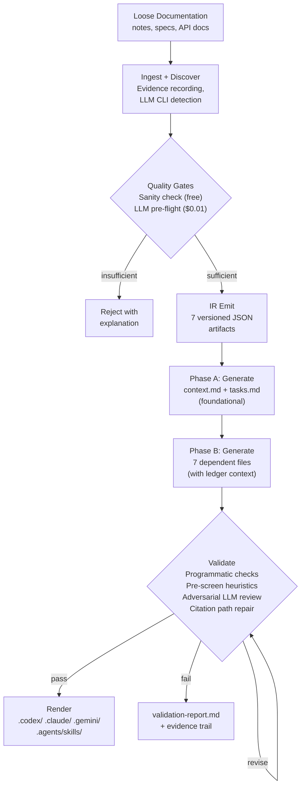
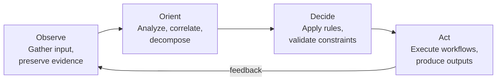
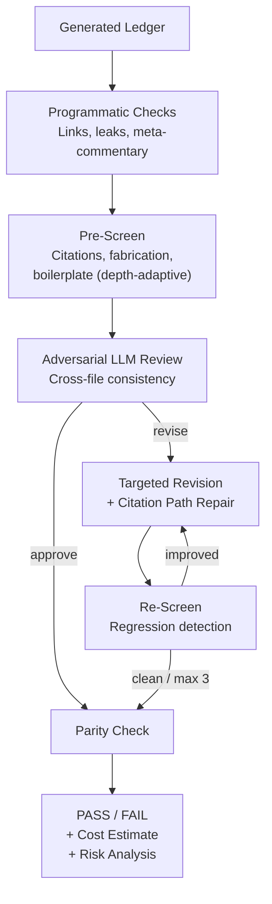

# Agent Engineering Reference

Design principles and production patterns that inform SwarmMaker's architecture. Derived from primary sources across the agent engineering field (2023-2026).

## SwarmMaker Pipeline Architecture

## Agent Decomposition (OODA)

## Validation Pipeline

## Core Definition

An agent runs tools in a loop to achieve a goal. Most production systems are **workflows** (predefined code paths) with one or two genuinely **agentic** loops embedded -- and that's usually the right architecture.

Agent = LLM + Planning + Memory + Tool use, with reflection as the loop primitive. Ablating any one of observation, reflection, or planning collapses long-horizon coherence (Park et al., UIST 2023).

## Cognitive Limits

Three problems dictate every design decision:

**Lost in the middle.** Performance is highest when information sits at the start or end of context, U-shaped degradation in the middle. SwarmMaker addresses this with constraint re-foregrounding -- critical rules are restated after source material, right before the LLM generates.

**Context rot.** All models degrade before their stated context limit. Effective reliable capacity is roughly 60-70% of the window. SwarmMaker sets TokenBudget to 70% of the raw window.

**Compounding error.** Per-step accuracy `p` over `N` steps yields `p^N` reliability. At 95% per step, a 20-step pipeline has ~36% expected success. SwarmMaker surfaces this in the validation report's Risk Analysis section and uses CHECKPOINT markers in skill process steps.

## Tool Design Principles

The five principles from Anthropic's empirical research (SWE-bench SOTA came from tool-description refinements alone):

1. **Build fewer, higher-leverage tools.** Match how a token-budgeted agent reasons, not how a programmer would call your REST API.
2. **Namespace aggressively.** Prefix conflicts confuse models.
3. **Return meaningful, agent-friendly context.** Human-readable identifiers over opaque IDs.
4. **Optimize for token efficiency.** Keep responses under 25K tokens. SwarmMaker caps adversarial review prompts at 30K chars.
5. **Prompt-engineer your tool descriptions.** They are part of the system prompt. Every spurious behavior pattern is fixable in the tool spec.

**Errors are prompts.** Structured errors with retryable flags and corrective guidance. SwarmMaker implements ExecutorError with Code, Retryable, and Guidance fields.

## The SKILL.md Standard

A Skill is a directory with a required `SKILL.md` file containing YAML frontmatter (`name`, `description`) and markdown instructions. Three levels of progressive disclosure:

| Level | When Loaded | Token Cost |
|-------|-------------|-----------|
| Metadata | Always (session start) | ~100 tokens |
| Instructions | When skill activates | <5,000 tokens |
| Resources | On demand (references/) | Unlimited |

The `description` is the routing mechanism. If a skill doesn't trigger, fix the description first. Descriptions should be "pushy" -- include explicit trigger and non-trigger conditions.

SwarmMaker generates SKILL.md files in `.agents/skills/` (cross-platform standard) plus platform-specific trees (`.claude/`, `.codex/`, `.gemini/`).

## Reasoning Patterns

| Pattern | When to Use | SwarmMaker Application |
|---------|-------------|----------------------|
| ReAct | Default for most tool-using agents | Each swarm task is a ReAct-style prompt |
| Plan-and-Execute | Long-horizon, mostly knowable up front | Two-stage compiler (Stage 1 plans, Stage 2 executes) |
| Reflexion | Only with external verifier signal | Adversarial review with programmatic pre-screen as external signal |

Pure intrinsic self-correction often degrades accuracy (Huang et al., ICLR 2024). Build self-critique loops only when there's a verifier the critic can consult. SwarmMaker's adversarial review uses programmatic checks (file existence, link integrity, citation density) as the external signal.

## Multi-Agent Discipline

Use multi-agent only when all of these hold:
- Task is read-heavy or has clearly parallelizable sub-tasks
- Information exceeds a single context window
- Task value justifies the token cost
- Sub-tasks have minimal hidden dependencies
- Final synthesis is single-threaded

SwarmMaker's swarm runs read-heavy tasks in parallel (each task reads shared source material, writes to its own file). Final synthesis (rendering) is single-threaded. Cross-file consistency is validated post-generation via adversarial review.

Two-phase generation (Phase A: foundational files first, Phase B: dependent files with ledger context) reduces cross-file contradictions caught in review.

## Production Hardening

**Circuit breakers:** Max steps (3 revision rounds), regression detection (stops if flag count doesn't decrease), prompt size limits (400K chars), timeout per LLM call.

**Prompt injection defense:** Source material scanned for injection patterns during ingestion. Detected patterns recorded as evidence events, never silently removed. Content is treated as potentially adversarial.

**Observability:** Evidence manifest (JSONL, append-only), IR artifacts with SHA-256 digests, validation report on every run (success and failure), cost estimates (token counts and dollar amounts).

**Citation path repair:** After each revision round, near-miss path hallucinations (LLM mangles directory but keeps filename) are auto-corrected against known source paths.

## Anti-Patterns Avoided

| Anti-Pattern | SwarmMaker Defense |
|-------------|-------------------|
| Auto-generated context files hurt performance (ETH study) | REVIEW_CHECKLIST.md warns users to curate before deploying |
| Vague skill descriptions | Frontmatter descriptions with trigger conditions |
| ALL-CAPS MUSTs brittle-fail on edge cases | Reasoned guidance with rationale throughout |
| Monolithic skills >500 lines | Progressive disclosure split to references/ |
| No eval or observability | Validation report, evidence trail, cost tracking |
| Parallel write actions | Each task writes to exactly one file; workspace write validation |
| Forgetting compounding error | Risk Analysis section with p^N calculations |

## Key Sources

- Weng, L. (2023). LLM Powered Autonomous Agents.
- Schluntz, E., & Zhang, B. (2024). Building Effective Agents. Anthropic.
- Anthropic Engineering. (2025). Writing effective tools for AI agents.
- Anthropic Engineering. (2025). Equipping agents for the real world with Agent Skills.
- Liu, N., et al. (2024). Lost in the Middle. TACL.
- Huang, J., et al. (2024). Large Language Models Cannot Self-Correct Reasoning Yet. ICLR.
- Shinn, N., et al. (2023). Reflexion: Language Agents with Verbal Reinforcement Learning. NeurIPS.
- Cognition AI. (2025/2026). Don't Build Multi-Agents / Multi-Agents: What's Actually Working.
- ETH Zurich. (2025). Evaluation of LLM-generated vs developer-written AGENTS.md files.

For the complete research analysis, see the full report used to design SwarmMaker's pipeline architecture.
