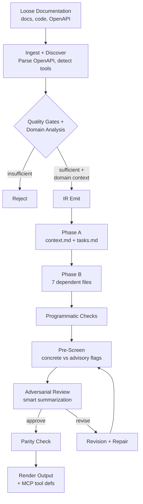
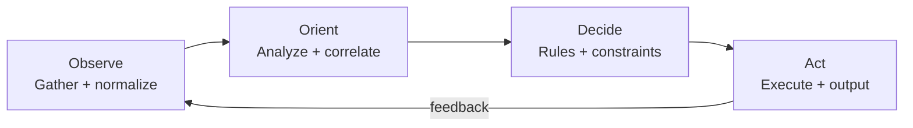
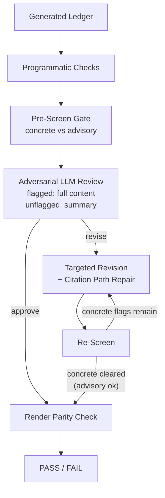

# Agent Engineering Reference

Design principles and production patterns that inform SwarmMaker's architecture. Derived from primary sources across the agent engineering field (2023-2026).

## SwarmMaker Pipeline Architecture

SwarmMaker is a two-stage compiler. Stage 1 uses LLM calls to decompose loose documentation into a structured `.tasks/` ledger with per-claim citations. Stage 2 is a deterministic, LLM-free render from that ledger into platform-specific skill trees. The pipeline enforces quality at every boundary: input quality gates prevent wasted LLM spend, two-phase generation reduces cross-file contradictions, and a multi-layer validation pipeline catches fabrication, citation drift, and schema violations before any output is written.

The quality gates run in two tiers: a zero-cost sanity check rejects empty directories, then a single LLM pre-flight call (~$0.01) judges whether the source material can produce at least one working skill and returns structured domain analysis (domain description, key entities, tool/API detection) that is injected into generation prompts. Generation runs in two phases: foundational files first (context.md, tasks.md), then dependent files with a summary of Phase A injected into their prompts. Validation runs programmatic checks, depth-adaptive pre-screening, adversarial LLM review (with smart summarization: flagged files get full content, unflagged get structured summaries), and up to 3 targeted revision rounds with regression detection and citation path repair.

## Agent Decomposition (OODA)

Generated agents follow the OODA loop (Observe-Orient-Decide-Act), a decision-cycle framework that maps well to autonomous agent coordination. Each agent is assigned an explicit OODA role with defined handoffs, owned skill slugs, coordination protocols specifying exact data shapes, and error handling derived from source constraints. Multiple agents may share the same role when the domain requires distinct execution concerns within a phase.

Each generated skill includes numbered process steps (typically 6-12) with decision branches, failure handling, and CHECKPOINT markers for intermediate state persistence. Constraints are split into Required and Prohibited sections derived from source material, and UNKNOWN gates name which process steps they block.

## Validation Pipeline

Every generated ledger passes through six validation layers. No layer can be skipped. The programmatic layer has veto power over the LLM reviewer: concrete pre-screen findings block approval even if the adversarial reviewer says APPROVE. Advisory findings (anti-pattern checks like excessive ALL-CAPS or missing coordination protocol sections) inform the reviewer without blocking the build.

The validation report includes a per-task Cost Breakdown table (input/output tokens and estimated USD per LLM call) and a Risk Analysis section that computes compound reliability estimates based on total process steps across all skills. Each skill also emits an `mcp_tool.json` file with an MCP-compatible tool definition for integration with MCP tool servers. The input schema is LLM-generated via a fenced JSON Schema block mandated by the skill compiler contract, not regex-parsed from prose.

## Core Definition

An agent runs tools in a loop to achieve a goal. Most production systems are **workflows** (predefined code paths) with one or two genuinely **agentic** loops embedded, and that's usually the right architecture.

Agent = LLM + Planning + Memory + Tool use, with reflection as the loop primitive. Ablating any one of observation, reflection, or planning collapses long-horizon coherence (Park et al., UIST 2023).

## Context and Reliability

Frontier models (GPT-5.4, Claude Opus 4.x, Gemini 3 Pro) with 1M+ context windows have largely resolved the "lost in the middle" attention degradation that affected earlier models. SwarmMaker's typical prompts are 15-20K chars, well within reliable capacity for any current model.

The one constraint that remains model-independent is **compounding error**: per-step accuracy `p` over `N` steps yields `p^N` reliability. This is mathematics, not a model limitation. A 78-step skill pipeline at 99% per-step accuracy has ~45.7% expected end-to-end success. SwarmMaker surfaces this in the validation report's Risk Analysis section so users can assess whether their generated pipeline needs intermediate checkpoints or independent verification at key stages.

## Tool Design Principles

The five principles from Anthropic's empirical research (SWE-bench SOTA came from tool-description refinements alone):

1. **Build fewer, higher-leverage tools.** Match how a token-budgeted agent reasons, not how a programmer would call your REST API.
2. **Namespace aggressively.** Prefix conflicts confuse models.
3. **Return meaningful, agent-friendly context.** Human-readable identifiers over opaque IDs.
4. **Optimize for token efficiency.** Keep responses under 25K tokens. SwarmMaker caps adversarial review prompts at 30K chars.
5. **Prompt-engineer your tool descriptions.** They are part of the system prompt. Every spurious behavior pattern is fixable in the tool spec.

**Errors are prompts.** Structured errors with retryable flags and corrective guidance. SwarmMaker implements ExecutorError with Code, Retryable, and Guidance fields.

## The SKILL.md Standard

A Skill is a directory with a required `SKILL.md` file containing YAML frontmatter (`name`, `description`) and markdown instructions. Three levels of progressive disclosure:

| Level | When Loaded | Token Cost |
|-------|-------------|-----------|
| Metadata | Always (session start) | ~100 tokens |
| Instructions | When skill activates | <5,000 tokens |
| Resources | On demand (references/) | Unlimited |

The `description` is the routing mechanism. If a skill doesn't trigger, fix the description first. Descriptions should be "pushy" and include explicit trigger and non-trigger conditions.

SwarmMaker generates SKILL.md files in `.agents/skills/` (cross-platform standard) plus platform-specific trees (`.claude/`, `.codex/`, `.gemini/`).

## Reasoning Patterns

| Pattern | When to Use | SwarmMaker Application |
|---------|-------------|----------------------|
| ReAct | Default for most tool-using agents | Each swarm task is a ReAct-style prompt |
| Plan-and-Execute | Long-horizon, mostly knowable up front | Two-stage compiler (Stage 1 plans, Stage 2 executes) |
| Reflexion | Only with external verifier signal | Adversarial review with programmatic pre-screen as external signal |

Pure intrinsic self-correction often degrades accuracy (Huang et al., ICLR 2024). Build self-critique loops only when there's a verifier the critic can consult. SwarmMaker's adversarial review uses programmatic checks (file existence, link integrity, citation density) as the external signal.

## Multi-Agent Discipline

Use multi-agent only when all of these hold:
- Task is read-heavy or has clearly parallelizable sub-tasks
- Information exceeds a single context window
- Task value justifies the token cost
- Sub-tasks have minimal hidden dependencies
- Final synthesis is single-threaded

SwarmMaker's swarm runs read-heavy tasks in parallel (each task reads shared source material, writes to its own file). Final synthesis (rendering) is single-threaded. Cross-file consistency is validated post-generation via adversarial review.

Two-phase generation (Phase A: foundational files first, Phase B: dependent files with ledger context) reduces cross-file contradictions caught in review.

## Production Hardening

**Circuit breakers:** Max steps (3 revision rounds), regression detection (stops if flag count doesn't decrease), prompt size limits (400K chars), timeout per LLM call.

**Prompt injection defense:** Source material scanned for injection patterns during ingestion. Detected patterns recorded as evidence events, never silently removed. Content is treated as potentially adversarial.

**Observability:** Evidence manifest (JSONL, append-only), IR artifacts with SHA-256 digests, validation report on every run (success and failure), cost estimates (token counts and dollar amounts).

**Citation path repair:** After each revision round, near-miss path hallucinations (LLM mangles directory but keeps filename) are auto-corrected against known source paths.

## Anti-Patterns Avoided

| Anti-Pattern | SwarmMaker Defense |
|-------------|-------------------|
| Auto-generated context files hurt performance (ETH study) | REVIEW_CHECKLIST.md warns users to curate before deploying |
| Vague skill descriptions | Frontmatter descriptions with trigger conditions |
| ALL-CAPS MUSTs brittle-fail on edge cases | Reasoned guidance with rationale throughout |
| Monolithic skills >500 lines | Progressive disclosure split to references/ |
| No eval or observability | Validation report, evidence trail, cost tracking |
| Parallel write actions | Each task writes to exactly one file; workspace write validation |
| Forgetting compounding error | Risk Analysis section with p^N calculations |

## Key Sources

- Weng, L. (2023). LLM Powered Autonomous Agents.
- Schluntz, E., & Zhang, B. (2024). Building Effective Agents. Anthropic.
- Anthropic Engineering. (2025). Writing effective tools for AI agents.
- Anthropic Engineering. (2025). Equipping agents for the real world with Agent Skills.
- Liu, N., et al. (2024). Lost in the Middle. TACL.
- Huang, J., et al. (2024). Large Language Models Cannot Self-Correct Reasoning Yet. ICLR.
- Shinn, N., et al. (2023). Reflexion: Language Agents with Verbal Reinforcement Learning. NeurIPS.
- Cognition AI. (2025/2026). Don't Build Multi-Agents / Multi-Agents: What's Actually Working.
- ETH Zurich. (2025). Evaluation of LLM-generated vs developer-written AGENTS.md files.
